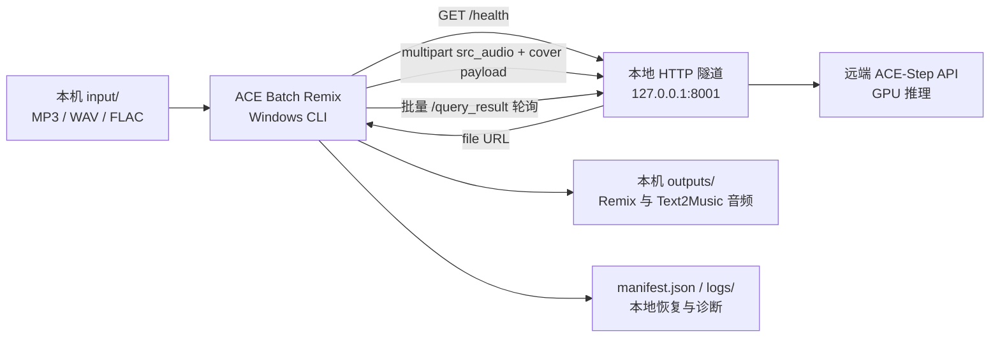

<!-- 文件用途：面向首次访问者介绍 ACE Batch Remix 的价值、架构、使用方式、配置和可靠性边界。 -->

# ACE Batch Remix

> 面向 [ACE-Step 1.5](https://github.com/ace-step/ACE-Step-1.5) 的可靠 Windows 批量客户端：既可为本地音频生成 Remix，也可无参考音频地批量 text2music，还能将本地歌单顺序合成为一首 FLAC。

ACE Batch Remix 不训练模型，也不修改 ACE-Step 源码。它解决的是批量实验中最容易出错的那层工作：**提交、轮询、断点恢复、下载和结果管理**。适用于已经能通过 SSH Tunnel、Tailscale 或其他方式访问 ACE-Step HTTP API 的个人工作站。

## 为什么需要它

直接逐首调用远端 API，常会遇到：任务断开后不知道是否已经提交、重复运行覆盖旧实验、下载中断留下半个文件，以及数十首歌难以对应各自的 seed 和生成参数。

本项目将这些风险收敛为一个本地 CLI 工作流：

- **一次批处理，多版本输出**：扫描 `input/`，每首歌按 `batch_size` 提交一个 Remix 任务；当前配置为每首 4 个 MP3。
- **断点可恢复**：以源文件 SHA-256 和生成设置指纹识别任务；中断后优先查询已提交任务，而不是盲目重复生成。
- **实验互不覆盖**：不同 Caption、强度或批量大小会写入不同的输出目录，可并存对比。
- **安全落盘**：下载先写 `.part` 临时文件，检查非空后原子改名；源文件名、任务 ID、服务端 seed、错误均保存到本地 manifest。
- **Unicode 友好**：全程使用 UTF-8 与 `pathlib`，支持中文、日文和混合文件名。

## 工作原理



1. 客户端先检查 `GET /health`，避免在隧道或远端服务未就绪时提交任务。
2. 每首输入音频以 multipart `src_audio` 上传，并用 ACE-Step 的 `cover` 语义提交 Remix 请求。
3. 全部待办歌曲先快速进入远端队列；随后客户端用单次 `/query_result` 批量查询所有未完成 task ID。
4. 成功结果中的每个 `file` URL 会被流式下载到本机，完成后才写入所配置格式的最终音频文件。

**推理与临时生成文件位于远端 ACE-Step 机器；最终音频、manifest 和日志位于运行本仓库的本机。**

## 技术栈

| 层级 | 选型 | 职责 |
| --- | --- | --- |
| Runtime | Python 3.10+ | Windows CLI 与文件处理 |
| HTTP | `requests` | multipart 上传、健康检查、轮询和流式下载 |
| 本地音频 | FFmpeg | 歌单解码、统一音频参数与 FLAC 顺序拼接 |
| 状态 | JSON manifest | 任务身份、状态、seed、重试与输出路径的本地持久化 |
| 远端推理 | ACE-Step 1.5 API | 音频 `cover` / Remix 生成 |
| 测试 | 标准库 `unittest` + Mock HTTP Server | 不依赖 GPU 的协议、恢复和下载回归测试 |

依赖保持刻意精简：Python 运行时只需要 `requests`。没有数据库、Web UI、Docker 容器或额外队列服务。仅使用本地拼接时不需要 ACE-Step Server 或 Python HTTP 依赖，但需要 [FFmpeg](https://ffmpeg.org/) 在 `PATH` 中。

## 快速开始

### 前置条件

- Windows 与 Python 3.10+；安装 Python 时请勾选 Python Launcher（`py`）。
- 一台已运行 ACE-Step API 的远端 GPU 机器。
- 已建立的本机 HTTP 转发；默认访问地址是 `http://127.0.0.1:8001`。
- 合法拥有或获授权处理的 `.mp3`、`.wav` 或 `.flac` 音频文件。

> 本仓库不负责启动远端 ACE-Step、建立 SSH Tunnel / Tailscale，也不包含模型权重或 API 鉴权管理。

### 3 分钟跑通

```powershell
# 1. 安装唯一的运行时依赖
py -3 -m pip install -r requirements.txt

# 2. 将音频放入 input\，确认 config.json 中 server_url 与 music_caption 正确

# 3. 先做单曲链路验证
py -3 batch_remix.py --limit 1

# 4. 正式处理 input\ 下的全部歌曲
py -3 batch_remix.py
```

### 批量生成 Lo-fi 纯音乐

`text2music` 不读取 `input/`，也不会上传 `src_audio` 或 reference audio。默认 `config.json` 已提供 FLAC Lo-fi 纯音乐示例；按需修改 `text2music` 配置段后运行：

```powershell
# 默认每首单独提交；20 首会拆为 20 个远端任务
py -3 batch_remix.py --mode text2music --count 20
```

为多条 prompt 分组生成时，传入稳定英文标签即可让目录和文件名保留来源，例如：

```powershell
py -3 batch_remix.py --mode text2music --count 4 --label rainy_window_study --caption "Dreamy rainy-night lo-fi instrumental ..."
# outputs/text2music/rainy_window_study__<设置指纹>/rainy_window_study_0001.flac
```

text2music 可配置 `music_caption`、`audio_duration`（10–600 秒）、`instrumental`、`thinking`、`inference_steps`、`audio_format`、`batch_size`、`use_random_seed` 与 `seed`。默认 `batch_size=1`，即同一个 prompt 的每首歌是独立 API 任务；只有明确提高它时才会在同一任务内生成多个候选。格式支持 `flac`、`wav`、`wav32`、`mp3`、`opus`、`aac`；建议优先 FLAC/WAV。

同一套 text2music 生成设置会形成一个可恢复集合：再次执行相同 `--count` 会跳过已成功文件；将 `--count 20` 增大为 `--count 30` 时仅生成 21–30 号。已完成任务下载失败时只重试下载；远端任务丢失或结果不完整时只重新提交缺失曲目。提交超时会保持 `submission_uncertain`，不会自动盲目重投。

当 `use_random_seed=false` 时，首目标序号为 `n` 的 API 子任务使用 `seed + n - 1`，避免不同子任务重复同一固定种子批次。

也可以直接双击 [`run.bat`](run.bat)。它只负责调用本机 Python；依赖缺失时会给出安装提示，不会擅自安装依赖、启动远端服务或创建隧道。

如果系统没有 Python Launcher（`py`），将上面命令中的 `py -3` 替换为已安装 Python 的 `python` 即可。

### 按歌单顺序拼接本地歌曲

`concat` 是完全本地的音频处理模式：不读取 `config.json`、不访问 ACE-Step，也不创建远端任务。准备一个 UTF-8 文本歌单，每行一个 `.mp3`、`.wav` 或 `.flac` 文件；空行与 `#` 开头的注释会忽略，相对路径以歌单文件所在目录解析。

```text
# playlists/night-drive.txt
../outputs/text2music/rainy_window/track_0001.flac
D:/Music/licensed-intro.mp3
../input/outro.wav
```

确认 `ffmpeg -version` 能在运行命令的 PowerShell 中执行后，运行：

```powershell
py -3 batch_remix.py --mode concat --playlist "playlists/night-drive.txt" --label "night-drive"
# outputs/concat/night-drive.flac
```

不同输入编码、采样率或声道布局会由 FFmpeg 统一处理为 48 kHz 双声道 FLAC。该模式不插入静音、不做淡入淡出、节拍匹配或响度归一化，因此会按清单顺序紧接着播放原始曲目内容。已有同名输出会拒绝覆盖；完成前只存在临时文件，成功且非空后才原子改名。

如果当前终端没有继承系统的 FFmpeg `PATH`，可直接指定可执行文件：

```powershell
py -3 batch_remix.py --mode concat --playlist "playlists/night-drive.txt" --label "night-drive" --ffmpeg-bin "C:/ffmpeg/bin/ffmpeg.exe"
```

### 首次联调建议

在正式批量运行前，推荐用一首歌和临时 Caption 验证网络与 API 映射：

```powershell
# input\song.mp3 必须实际存在于 input\ 内
py -3 batch_remix.py --file "input\song.mp3" --caption "Japanese electronic remix, airy and spacious"
```

`--caption` 只影响当前进程，不会修改 `config.json`。移除 `--file`、`--limit` 和 `--caption` 后，程序会恢复到正式 Caption 和全量输入。

## 配置与 ACE-Step 映射

所有实验设置集中在 [`config.json`](config.json)。当前默认配置是一套“保留旋律与节奏骨架、弱化重鼓和低频、增强空间感”的日系电子 Remix 提示词，并设置每首输出 4 个 MP3。

| 配置项 | 含义 | 当前 / 可用值 |
| --- | --- | --- |
| `server_url` | 本机可访问的 ACE-Step API 地址 | 默认 `http://127.0.0.1:8001` |
| `music_caption` | 目标风格与编曲约束 | 非空文本 |
| `remix_strength` | 原始音频对 Remix 的影响强度 | 数值 |
| `cover_strength` | Cover 噪声强度 | 数值 |
| `batch_size` | 每首歌的目标版本数 | 1–8；受远端 GPU 能力限制 |
| `audio_format` | Remix 下载格式 | `flac`、`wav`、`wav32`、`mp3`、`opus`、`aac`；当前 Remix 配置为 `mp3` |
| `poll_interval_seconds` | 远端任务轮询间隔 | 秒 |
| `max_retries` | 失效任务的最大重提次数 | 正整数 |

ACE-Step 请求字段只在 [`src/api.py`](src/api.py) 的 `build_remix_payload()` 中映射，便于在远端 API 升级时集中审查：

| 本项目概念 | ACE-Step REST 字段 |
| --- | --- |
| Remix 工作流 | `task_type=cover` + multipart `src_audio` |
| Music Caption | `prompt` |
| 未提供歌词 | 空 `lyrics` |
| Remix Strength | `audio_cover_strength` |
| Cover Strength | `cover_noise_strength` |
| 多版本生成 | `batch_size` |
| 输出格式 | `audio_format` |

映射依据 [ACE-Step API 文档](https://github.com/ace-step/ACE-Step-1.5/blob/main/docs/en/API.md) 与 [ACE-Step 推理参数源码](https://github.com/ace-step/ACE-Step-1.5/blob/main/acestep/inference.py)。升级远端 ACE-Step 后，请先审查这个函数并执行单曲人工验证；API 可用不等于声学效果已经满足制作要求。

## 输出、可追溯性与恢复

每个实验写入一个稳定目录，例如：

```text
outputs/
└── Brand New - Mrs. GREEN APPLE__661ecbff/
    ├── 原曲_Brand New - Mrs. GREEN APPLE.mp3
    ├── Brand New - Mrs. GREEN APPLE__661ecbff_01.mp3
    ├── Brand New - Mrs. GREEN APPLE__661ecbff_02.mp3
    ├── Brand New - Mrs. GREEN APPLE__661ecbff_03.mp3
    └── Brand New - Mrs. GREEN APPLE__661ecbff_04.mp3
```

`__661ecbff` 是生成设置指纹的短前缀，而不是随意编号。它由 Caption、`cover` 模式、两种强度、`batch_size`、输出格式和随机 seed 设置共同计算，因此：

- 同一首歌、同一设置再次运行会恢复或跳过已有完整输出；
- 修改 Caption 或关键生成设置会创建独立目录，不破坏旧实验；
- 同名源文件会追加短源文件指纹，避免相互覆盖；
- 正式实验目录可保留一个以 `原曲_` 开头的原始音频副本，方便同目录 A/B 对比。

[`manifest.json`](manifest.json) 记录源路径与 SHA-256、任务 ID、提交时间、状态、重试次数、服务端返回的 `seed_value`、输出路径和最终错误。它仅是本机运行状态，不应提交 Git。`logs/` 保存完整 HTTP/解析错误上下文，而终端只显示简洁进度与最终摘要。

text2music 使用 manifest v2 的 `text2music_runs` 命名空间，按设置指纹保存 run、远端 task 和稳定编号 track 三层状态；旧版 `songs` 中的 Remix 记录保持原样可恢复。text2music 输出形如 `outputs/text2music/<设置指纹>/track_0001.flac`。

## 可靠性边界

| 情况 | 客户端行为 |
| --- | --- |
| 隧道或 API 不可达 | 启动时健康检查失败并退出，提示检查地址、远端 API 与 Tunnel |
| 已提交任务仍在服务端 | 优先批量查询并继续下载，不重复提交 |
| 服务端丢失旧 task ID | 在 `max_retries` 范围内重新提交该歌曲，其余歌曲继续运行 |
| 上传读取超时 | 标为“提交结果不确定”，不会自动盲重投，避免远端已受理时生成重复任务 |
| 单个任务或下载失败 | 记录错误并继续其余歌曲，结束时以非零状态报告缺失版本 |
| 下载中断 | 保留或清理临时 `.part`，不把不完整文件伪装成最终音频 |

## 项目结构

```text
ace-batch-remix/
├── batch_remix.py          # CLI 入口：参数解析与退出码
├── config.json             # 本地实验设置
├── run.bat                 # Windows 双击入口
├── src/
│   ├── api.py              # ACE-Step HTTP 协议与 payload 映射
│   ├── audio_concat.py     # 本地歌单解析与 FFmpeg FLAC 顺序拼接
│   ├── config.py           # 配置读取与校验
│   ├── manifest.py         # 本地任务状态持久化
│   └── runner.py           # 扫描、状态机、轮询、下载与汇总
├── tests/                  # Mock API 回归测试
├── input/                  # 本地输入音频（Git 忽略）
├── outputs/                # 本地 Remix 与原曲副本（Git 忽略）
└── logs/                   # 本地错误日志（Git 忽略）
```

## 验证与开发

```powershell
# 静态编译检查
py -3 -m compileall -q batch_remix.py src tests

# 全套 Mock API 测试；不需要远端 GPU 或 Tunnel
py -3 -m unittest discover -v
```

自动测试覆盖健康检查、multipart 上传字段、集中轮询、一次任务返回多个版本、服务端 seed 记录、流式 URL 下载、原子完成、Unicode 路径、已有输出跳过、断点恢复、服务端丢失 task ID 后的有限重投和提交超时保护。

真实 ACE-Step Server 的可达性、目标模型版本、音频格式兼容性、GPU 可承载的 `batch_size` 和实际声学效果，仍是每次重要实验前应人工确认的上线前项。

## 常见问题

**生成的音频在哪里？** 远端机器先完成模型推理；客户端将结果下载到运行本仓库的电脑的 `outputs/`。`input/`、`outputs/`、`logs/` 与 `manifest.json` 均受 Git 忽略，不会被意外提交。

**一首歌最多生成几份？** 客户端允许 `batch_size` 为 1–8；实际可用上限取决于远端 ACE-Step 版本、GPU 显存和服务器配置。建议先从 1 或 2 做单曲验证，再扩大批量。

**可以直接用它生成吗？** 可以，前提是远端 ACE-Step API 已运行，且本机 `server_url` 能通过健康检查。这个仓库不会代替你建立网络连通性或启动远端 GPU 服务。

## 许可与使用边界

请只处理你拥有、获授权或法律允许用于该目的的音频素材；使用生成结果时也应遵守相关平台、版权与模型服务条款。
